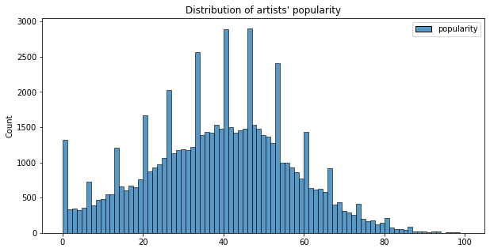

# Automatic Playlist Continuation 
Final project for the course Applied Data Science & Applications 

Faculty of Information Technology - University of Science, VNU-HCM

Team members: 
| Student ID | Student name      |
| ---------- |:----------------- |
| 1712524    | Nguyễn Duy Khánh  |
| 1712822    | Nguyễn Khánh Toàn |

---
**Table of content**
* Đề tài
* Cấu trúc folder 
* Thu thập dữ liệu 
* Mô tả dữ liệu và EDA 
* Xây dựng mô hình 
* Phân công công việc 
* Tổng quan kết quả 
* Hướng dẫn chạy 

--- 

## Đề tài 
### Giới thiệu đề tài 
*Automatic Playlist Continuation* là bài toán gợi ý những bài hát tương tự, phù hợp với một tập hợp những bài hát cho trước. Những bài hát được đánh giá "phù hợp" đôi khi mang nghĩa khá rộng, có thể những bài hát này cùng nghệ sĩ, cùng thể loại, cùng tính chất âm nhạc hay cũng có thể mang cùng ý nghĩa,... Vì tính mở của bài toán nên đây là một lĩnh vực nhận được sự chú ý của nhiều nhà nghiên cứu trong lĩnh vực âm nhạc. 

Một cách rõ ràng hơn, bài toán được xác định với:
* **Input**: một tập hợp **N** bài hát với những thuộc tính, đặc trưng cho trước 
* **Output**: danh sách **K** bài hát được gợi ý liên quan đến những bài hát đã cho 

### Ứng dụng của đề tài trong thực tế 
Bài toán đặt ra được ứng dụng để gợi ý những bài hát phù hợp với từng người dùng. Ví dụ [Spotify](https://www.spotify.com/us/) có tính năng tạo cho người dùng playlist `Weekly Discovery` hàng tuần dựa trên những bài hát họ nghe nhiều và yêu thích; hoặc tính năng gợi ý những bài hát phù hợp với một playlist do người dùng tạo ra `recommended based on what's in this playlist`.

Vì tính thực tiễn và ứng dụng của bài toán, Spotify đã tổ chức [RecSys 2018 Challenge](https://recsys.acm.org/recsys18/challenge/) để mọi người trên thế giới cùng tham gia giải quyết bài toán. 

## Cấu trúc folder 

```
playlist_continuation/
│
├── README.md - file mô tả 
├── requirements.txt - các package cần cài đặt 
├── .gitignore
│
├── data/ - folder chứa dữ liệu đã crawl được 
│   ├── artists.tsv - thông tin nghệ sĩ
│   ├── audio_features.tsv - đặc trưng âm thanh của bài hát 
│   ├── playlists.tsv - thông tin các playlist 
│   └── tracks.tsv - thông tin các bài hát 
│
├── images/ - folder chứa các biểu đồ và hình minh họa 
│   └── ... 
│   
└── source/ - folder chứa mã nguồn và các file notebook 
    ├── model/
    └── crawl & eda/ - folder chứ mã nguồn thu thập và khám phá dữ liệu 
            ├── Crawling.html - file HTML export từ mã nguồn 
            ├── Crawling.ipynb - mã nguồn thu thập dữ liệu 
            ├── EDA.html - file HTML export từ mã nguồn 
            └── EDA.ipynb - mã nguồn khám phá dữ liệu 

```
  
## Thu thập dữ liệu 
Dữ liệu sử dụng trong đồ án này được thu thập sử dụng:

* [spotipy](https://spotipy.readthedocs.io/en/2.16.1/) - thư viện Python giúp truy cập [Spotify Web API](https://developer.spotify.com/documentation/web-api/) một cách tiện lợi .
* [requests-html](https://pypi.org/project/requests-html/) - thư viện Python hỗ trợ xử lý HTML của các trang web.

Cụ thể, các dữ liệu thu thập được (chứa trong folder `data`) bao gồm


| Dữ liệu                          | Mô tả                                                                                   | Phương thức     | Thời gian thu thập | File               |
|:-------------------------------- |:--------------------------------------------------------------------------------------- | --------------- | ------------------ | ------------------ |
| Danh sách các playlist           | tập hợp những public playlist tổng hợp các bài hát do Spotify tạo ra                    | API             | 5 mins             | playlists.tsv      |
| Danh sách các track              | tập hợp những bài hát trong những playlist đã lấy được ở trên                           | API             | 5 mins             | tracks.tsv         |
| Đặc trưng âm thanh của các track | những thuộc tính về mặt âm thanh của các bài hát được phân tích và cung cấp bởi Spotify | API             | 15 mins            | audio_features.tsv |
| Danh sách các nghệ sĩ            | tập hợp những nghệ sĩ biểu diễn những bài hát đã thu được ở trên                        | API, parse HTML | 5.5 hours          | artists.tsv        |

Chi tiết quá trình thu thập dữ liệu có thể xem tại notebook `EDA.ipynb` hoặc file `EDA.html` (recommended).

## Mô tả dữ liệu và EDA 
### Tổng quan dữ liệu 
#### Bảng dữ liệu playlist (1412 dòng, 5 cột)

| Tên cột       | Kiểu dữ liệu | Ý nghĩa                            | Ví dụ                            |
| ------------- | ------------ |:---------------------------------- |:-------------------------------- |
| playlist_id   | string       | Giá trị ID unique ứng với playlist | 73boXMJz9iBoXxQVFZ94r5           |
| playlist_name | string       | Tên của playlist                   | National Blood Week              |
| description   | string       | Chuỗi mô tả playlist               | Kick back with the queens of pop |
| num_tracks    | int          | Số lượng bài hát có trong playlist | 70                               |
| num_followers | int          | Số người theo dõi playlist         | 2015059                          |

#### Bảng dữ liệu track (86432 dòng, 9 cột)

| Tên cột           | Kiểu dữ liệu    | Ý nghĩa                                  | Ví dụ                      |
| ----------------- | --------------- | ---------------------------------------- |:-------------------------- |
| track_id          | string          | Unique ID của bài hát                    | 6zFMeegAMYQo0mt8rXtrli     |
| track_name        | string          | Tên của bài hát                          | HOLIDAY                    |
| playlist_id       | string          | ID của playlist (ở phần a.) chứa bài hát | 37i9dQZF1DXcBWIGoYBM5M     |
| playlist_name     | string          | Tên của playlist ứng với `playlist_id`   | Today's Top Hits           |
| artist_ids        | list of strings | IDs của các nghệ sỹ trình diễn bài hát   | ['7jVv8c5Fj3E9VhNjxT4snq'] |
| artist_names      | list of strings | Tên của các nghệ sỹ trình diễn bài hát   | ['Lil Nas X']              |
| album_id          | string          | ID của album chứa bài hát                | 4EvukZrmNBiqJbs3LwOSHu     |
| album_name        | string          | Tên của album ứng với `album_id`         | HOLIDAY                    |
| track_duration_ms | int             | Độ dài của bài hát (ms)                  | 154997                     |

#### Bảng dữ liệu audio feature (68577 dòng, 16 cột)

Ý nghĩa của các trường trong audio track dataframe: 

| Tên cột           | Kiểu dữ liệu    | Ý nghĩa                                                                                                                                                                                                 | Ví dụ                                                            |
| ----------------- | --------------- | ------------------------------------------------------------------------------------------------------------------------------------------------------------------------------------------------------- |:---------------------------------------------------------------- |
| id                | string          | ID của bài hát                                                                                                                                                                                          | 5P701xOxwxzBnXiNQ7QDKb                                           |
| danceability      | float           | Mô tả bài hát có phù hợp để nhảy hay không dựa trên sự kết hợp, độ mạnh yếu của nhịp độ, nhịp điệu bài hát, có giá trị từ 0.0 - 1.0                                                                     | 0.218                                                            |
| energy            | float           | Độ đo thể hiện tính chất năng lượng của bài hát thông qua cường độ. Thông thường một bài hát energetic sẽ nhanh, ồn ào, có giá trị từ 0.0 - 1.0                                                         | 0.1770                                                           |
| key               | int             | Cao độ trung bình của hát, giá trị là số nguyên, tính theo chuẩn Pitch Class Notation, nếu không có cao độ giá trị là -1                                                                                | 2                                                                |
| loudness          | float           | Độ to trung bình của bài hát (tính theo đơn vị dB), giá trị thường rơi vào khoảng -60.0 - 0.0 dB                                                                                                        | -17.972                                                          |
| mode              | bool            | Biểu thị thể thức (chính hoặc phụ) của một bản nhạc, loại âm hưởng mà nội dung du dương của nó được bắt nguồn. Chỉ bao gồm 2 giá trị là 1 (chính) và 0 (phụ)                                            | 0                                                                |
| speechiness       | float           | Xác suất thể hiện có sự hiện diện của tiếng nói (khác với tiếng hát) trong bài hát hay không. Có giá trị trong khoảng 0.0 - 1.0, giá trị càng cao thì đây khả năng cao là bài diễn thuyết, sách nói,... | 0.0428                                                           |
| acousticness      | float           | Cường độ Acoustic của bài hát hay nói cách khác là xác suất bài hát này có tính chất acoustic, có giá trị từ 0.0 - 1.0                                                                                  | 0.870                                                            |
| instrumentalness  | float           | Độ đo thể hiện tính instrumental (không lời) của bài hát, có giá trị trong khoảng 0.0 - 1.0, giá trị càng cao thì càng ít giọng hát trong bài hát                                                       | 0.908000                                                         |
| liveness          | float           | Độ đo thể hiện tính live (nhạc sống, có sự hiện diện của khán giả trong lúc thu âm) của bài hát, có giá trị trong khoảng 0.0 - 1.0                                                                      | 0.209                                                            |
| valence           | float           | Biểu thị tính tích cực của bài hát, giá trị càng cao thì bài hát càng có tính chất tích cực (vui, phấn khởi), càng thấp thì bài hát càng buồn                                                           | 0.199                                                            |
| tempo             | float           | Nhịp độ trung bình của bài hát tính theo nhịp mỗi phút (BPM)                                                                                                                                            | 122.841                                                          |
| analysis_url      | string          | URL chứa thông tin phân tích chi tiết audio của bài hát                                                                                                                                                 | https://api.spotify.com/v1/audio-analysis/5P701xOxwxzBnXiNQ7QDKb |
| time_signature    | int             | Số chỉ nhịp của bài                                                                                                                                                                                     | 3                                                                |
| available_markets | list of strings | Các quốc gia có thể nghe bài hát này                                                                                                                                                                    | ['US']                                                           |
| popularity        | int             | Mức độ phổ biến, yêu thích của bài (từ 0-100)                                                                                                                                                           | 14                                                               |

#### Bảng dữ liệu artist (67630 dòng, 6 cột)

| Tên cột           | Kiểu dữ liệu    | Ý nghĩa                                | Ví dụ                                |
| ----------------- | --------------- | -------------------------------------- |:------------------------------------ |
| id                | string          | ID của nghệ sĩ                         | 1EH9eSje47IiRyVsq3gfkl               |
| name              | string          | Tên của nghệ sĩ                        | Raven                                |
| popularity        | int             | Mức độ nổi tiếng/yêu thích của nghệ sĩ | 35                                   |
| genres            | list of strings | Thể loại nhạc của artist               | ['swedish pop punk', 'swedish punk'] |
| num_followers     | int             | Số người theo dõi                      | 368                                  |
| monthly_listeners | int             | Số người nghe mỗi tháng                | 1509                                 |

### Khám phá dữ liệu (EDA)

Chi tiết quá trình EDA có thể xem tại notebook `EDA.ipynb` hoặc file `EDA.html` (recommended).

#### 1. Phân bố lượt theo dõi và số bài hát mỗi playlist:


**Nhận xét**: 
- Cả số lượng bài hát & (đặc biệt là) số lượt theo dõi đều có phân bố lệch trái 
- Số lượng bài hát của mỗi playlist tập trung ở khoảng dưới 100 bài (giá trị median khoảng 55), một số lượng vừa đủ, đảm bảo playlist không quá dài và không quá ngắn (bài toán recommend bài hát để tiếp tục playlist có thể gợi ý số bài hát ở khoảng vài chục để phù hợp với hầu hết các playlist)
- Số lượt theo dõi có sự chênh lệch rất khác biệt giữa các playlist. Trong khi hầu hết các playlist có số followers nhỏ hơn 500k, những playlist hot nhất có số lượt theo dõi cao gấp rất nhiều lần (chủ yếu gấp 15 lần), playlist nổi tiếng nhất có lượt followers hơn 27M, tức gấp hơn 54 lần những playlist thông thường!

#### 2. Các playlist có số lượng người theo dõi nhiều nhất


**Nhận xét**: 
- Ta thấy playlist có nhiều người theo dõi nhất là `Today's Top Hits`, có thể lý giải bởi gần như mọi người đều muốn cập nhật những bài hát mới và nổi tiếng nhất **theo ngày**.
- Những playlist tiếp theo nằm trong top là những playlist chia theo **thể loại nhạc** như Rap, R&B (Are & Be), Rock, ...
- Trong top những playlist này có playlist `Black Lives Matter`, thể hiện phong trào đấu tranh cho người da đen gần đây ở Mỹ. Điều này cho ta thấy rõ ràng âm nhạc là một phần rất gần gũi của cuộc sống con người, xu hướng âm nhạc phản ánh những gì đang diễn ra ngoài xã hội.

#### 3. Các playlist có số lượng tracks nhiều nhất


**Nhận xét**: playlist có nhiều bài hát nhất là `The Critics Choice 2012`, có thể đây là playlist tập hợp những bài hát được lựa chọn để nghe trong năm 2012. Dựa vào description của các playlists, ta có thể thấy những playlist chứa nhiều tracks nhất là tập hợp những audio để học một ngôn ngữ nào đó (Italian, Chinese, German, ...) hoặc là tập hợp những công trình/tác phẩm của một tác giả nào đó, ...

#### 4. Số lượng tracks của 20 playlist hot nhất


**Nhận xét**: Dựa vào bảng và biểu đồ trên, ta thấy hầu hết các top playlists có số bài hát nhỏ hơn 100 bài. Những playlist có nhiều bài hát hơn cũng chỉ có nhiều nhất khoảng 300 bài hát. Điều này phần nào thể hiện xu thế những playlist phổ biến có số lượng track không quá nhiều.

#### 5. Các từ được sử dụng nhiều nhất để đặt tên playlist và mô tả playlist


**Nhận xét**: 
Dễ dàng nhận thấy những từ phổ biến nhất trong tên bài hát là những từ chỉ **thể loại** nhạc như *Rock, Pop, Metal, Classical, ...* hay những từ thể hiện **mục đích** của playlist như *Happy Birthday, Pride, Party, Work, Chill, ...* Những từ này được chọn vì nó thể hiện rõ ràng theme của playlist, dễ hình dung nội dung playlist khi đọc.


**Nhận xét:**
Khác với những từ trong tên playlist, những từ phổ biến nhất để mô tả playlist là những từ mô tả **tập hợp, bài hát** như *collection, playlist, track, music, song* và những từ chỉ **thể loại** như *cover, rock, pop, classic, ...*

#### 6. Giá trị trung bình các thuộc tính số (numeric features) của các playlists phân bố như thế nào?


**Nhận xét:** Dựa vào các biểu đồ trên, ta nhận thấy distribution giá trị trung bình các thuộc tính `danceability`, `energy`, `key`, `loudness`, `mode`, `acousticness`, `liveness`, `valence`, `tempo`, `popularity` của các playlists phân bố rải rác (không quá tập trung) trong miền giá trị tương ứng và có độ lệch chuẩn (thể hiện qua box plot ở mỗi histogram) không quá nhỏ. Điều này cho thấy có sự khác biệt ở các thuộc tính trên giữa các playlists, có thể sử dụng chúng để dự đoán những bài hát liên quan đến một tập các bài hát cho trước.

#### 7. Các nghệ sĩ có số lượng tracks nhiều nhất


**Nhận xét**: Những nghệ sĩ có nhiều bài hát nhất bao gồm cả những nghệ sĩ trẻ (Talor Swift, Ed Sheeran, ...), những nghệ sĩ lâu năm (The Beatles, Johnny Cash), công ty phát hành sách (Penton Overseas), nhà soạn nhạc (Beethoven). Đây đều là những tên tuổi hàng đầu được nhiều người biết đến.

#### 8. Phân bố mức độ yêu thích/nổi tiếng (popularity) của các nghệ sĩ 


**Nhận xét:** ta thấy distribution mức độ nổi tiếng/yêu thích của các nghệ sĩ có hình dạng gần chuẩn.

#### 9. Genre phổ biến mà các nghệ sĩ theo đuổi 


**Nhận xét:** ta có thể thấy những genre phổ biến nhất là những (biến thể) của các thể loại *pop*, *rock*, *dance*, *rap*, ...

#### 10. Thời lượng của các bài hát được phân bố như thế nào? 


**Nhận xét**:
Ta thấy hầu hết các bài hát đều có độ dài từ 180-240s (3-4 phút)

#### 11. Các thuộc tính liên quan đến tâm trạng bài hát (Danceability, Valence, Energy, Tempo) được phân bố như thế nào?


**Nhận xét**:
- Chỉ có thuộc tính `danceability` có phân bố gần chuẩn, các thuộc tính khác `valence`, `energy`, `tempo` có distribution phức tạp với nhiều modes 
- Thuộc tính `tempo` có scale lớn hơn nhiều so với các thuộc tính còn lại, nên cần chú ý trong quá trình xây dựng mô hình
- Cả 4 thuộc tính trên đều có các giá trị nằm rải rác trong miền giá trị của chúng, thể hiện sự đa dạng và phân bố khá liên tục của các bài hát.

#### 12. Các thuộc tính liên quan đến đặc điểm bài hát (Loudness, Speechiness, Instrumentalness) được phân bố như thế nào?


**Nhận xét:**
- Ta nhận thấy chỉ có thuộc tính `loudness` là có phân bố khá liên tục, các điểm dữ liệu không quá tập trung tại một vùng nào đó.
- Khác với các thuộc tính ở trên, `speechiness` và `instrumentalness` có distribution với 2 cụm điểm tách biệt. Điều này phù hợp với ý nghĩa của các trường này: *speechiness* thể hiện một track là bài hát hay bài diễn thuyết, *instrumentalness* thể hiện một track có lời hay không lời. Mặc dù đây là 2 biến liên tục nhưng trong quá trình xây dựng mô hình, ta có thể xét ngưỡng để biến 2 biến này thành dạng rời rạc.

#### 13. Các thuộc tính liên quan đến bối cảnh bài hát (Liveness, Acousticness) được phân bố như thế nào?


**Nhận xét**:
- Thuộc tính `liveness` có phân bố tập trung hơn so với thuộc tính `acousticness`
- `acousticness` có distribution với 2 mode 0 và 1, có lẽ phản ánh sự tách biệt giữa những bài hát thu âm và những bài hát được hát theo phong cách acoustic.

#### 14. Số lượng quốc gia có thể nghe được của mỗi bài hát


**Nhận xét:** ta thấy hầu hết các bài hát đều available tại toàn bộ các quốc gia (có tất cả 92 quốc gia trong tập dữ liệu), hoặc chỉ available tại 1 quốc gia nhất định.

#### 15. Tương quan giữa các thuộc tính Danceability, Valence, Energy, Tempo, Loudness, Speechiness, Instrumentalness, Liveness, Acousticness, Duration, Popularity


**Nhận xét**: dựa vào heatmap trên, ta có thể đưa ra một vài nhận xét về tương quan giữa các biến:
- `valence`, `danceability` và `energy` có mối tương quan dương (khá hợp lý vì đây là các thuộc tính thể hiện tính "nhún nhảy", tích cực và năng lượng của một bài hát)
- `track_duration_ms` và `speechiness` có mối tương quan dương (0.3). Điều này có thể giải thích như sau: bài nói/thuyết trình (có speechiness lớn) thường dài hơn những bài hát thông thường.
- `acousticness` có mối tương quan âm với `loudness` và `energy`: những bài hát acoustic thường không quá lớn tiếng và mang tính thư giãn, cảm nhận nhiều hơn
- `loudness` và `energy` có mối tương quan dương: một bài hát càng có cường độ lớn thường sẽ mang nhiều năng lượng 
- `instrumentalness` và `loudness` có tương quan âm: bài hát không lời (có instrumentalness lớn) thường sẽ nhẹ nhàng

## Xây dựng mô hình 
### Độ đo đánh giá 
Độ đo sử dụng để đánh giá mô hình là **R-precision** được tính bởi công thức:
$$ \text{R-precision} = \frac{| G \cap R|}{|G|} $$
trong đó:
* $G$: tập những bài hát được giữ lại (ground-truth)
* $R$: tập những bài hát dự đoán (retrieved)

### Các mô hình sử dụng 
Mô tả các mô hình sau đây ứng với input có **N** seed tracks, và cần dự đoán **K** bài hát gợi ý. 

#### 1. Baseline model

* **Thuộc tính**: dựa vào kết quả EDA, sử dụng 5 thuộc tính có phân phối gần chuẩn nhất bao gồm `danceability`, `energy`, `acousticness`, `valence`, `popularity`.
* **Mô tả ý tưởng**:
    * Tính **K** tracks trong tập hợp tất cả các tracks (trừ những seed tracks) có khoảng cách L2 gần nhất với từng seed track, ta được tập **N x K** tracks.
    * Sort các tracks vừa tìm được theo tần suất xuất hiện và chọn **K** tracks xuất hiện nhiều nhất làm kết quả dự đoán.

#### 2. Improved baseline model

* **Thuộc tính**: chọn 5 features tốt nhất lấy từ 2 mô hình `LightGBM` và `ExtraTreesClassifier`.
* **Mô tả ý tưởng**:
    * Để chọn các features tốt nhất, ta đưa bài toán về dạng classification: với mỗi track, ta sẽ predict xem track đó thuộc playlist nào (chọn ngẫu nhiên 1 playlist nếu 1 track thuộc nhiều playlist) và xem đó như label của track; xây dựng 2 mô hình `LightGBM` và `ExtraTreesClassifier` dự đoán label cho các tracks; tính tổng feature importance từ 2 mô hình và chọn 5 features có độ quan trọng cao nhất.
    * Sau khi chọn được features, ta thực hiện hoàn toàn tương tự baseline model để đưa ra gợi ý.
    
#### 3. KNN

* **Thuộc tính**: lấy toàn bộ các thuộc tính số (numeric features) của các track làm đặc trưng.
* **Mô tả ý tưởng**:
    * Từ các vector biểu diễn **N** seed tracks, ta tính trung bình và được mean vector.
    * Tìm **K** tracks trong tập hợp tất cả các tracks (trừ những seed tracks) có khoảng cách L2 gần nhất với mean vector làm kết quả dự đoán.
    
#### 4. Content filtering

* **Thuộc tính**: lấy toàn bộ các thuộc tính số (numeric features) của các track làm đặc trưng.
* **Mô tả ý tưởng**:
    * Tính **K** tracks trong tập hợp tất cả các tracks (trừ những seed tracks) có khoảng cách cosine (cosine similarity) gần nhất với từng seed track, ta được tập **N x K** tracks.
    * Sắp xếp các tracks vừa tìm được theo tần suất xuất hiện và chọn **K** tracks xuất hiện nhiều nhất làm kết quả dự đoán.
    
#### 5. k-means clustering

* **Thuộc tính**: lấy toàn bộ các thuộc tính số (numeric features) của các track làm đặc trưng.
* **Mô tả ý tưởng**:
    * Phân cụm tất cả các bài hát thành **k** cụm sử dụng thuật toán K-means clustering, chọn giá trị **k** sử dụng phương pháp khuỷu tay (*elbow method*).
    * Với tập hợp các seed tracks, ta chọn 1 cluster chứa nhiều seed tracks nhất. Sau khi chọn được cluster, ta sẽ sắp xếp các tracks theo thứ tự giảm dần của thuộc tính `popularity` và chọn **K** bài hát có giá trị `popularity` cao nhất làm kết quả dự đoán. 
    
## Phân công công việc 

| Công việc                              | Phân công                           | Mức độ hoàn thành |
| -------------------------------------- | ----------------------------------- |:----------------- |
| Chuẩn bị mã nguồn thu thập dữ liệu     | Nguyễn Duy Khánh                    | 100%              |
| Thu thập dữ liệu                       | Nguyễn Duy Khánh                    | 100%              |
| EDA                                    | Nguyễn Duy Khánh, Nguyễn Khánh Toàn | 100%              |
| Lên ý tưởng xây dựng mô hình           | Nguyễn Duy Khánh, Nguyễn Khánh Toàn | 100%              |
| Xây dựng mô hình trên dữ liệu thu thập | Nguyễn Khánh Toàn                   | 100%              |
| Phân tích kết quả                      | Nguyễn Khánh Toàn                   | 100%              |
| Báo cáo                                | Nguyễn Duy Khánh, Nguyễn Khánh Toàn | 100%              |

## Tổng quan kết quả 
### Sơ lược kết quả các mô hình 

TODO 

### Đánh giá yêu cầu đồ án

- [x] Đặt ra được câu hỏi dự đoán 
- [x] Giải quyết bài toán theo quy trình Khoa học dữ liệu 
- [x] Dùng API để thu thập dữ liệu 
- [x] Thu thập dữ liệu sử dụng HTML 
- [x] Dùng mô hình máy học để mô hình hóa dữ liệu 

### Hạn chế, hướng phát triển bài toán

- Các playlist thu thập được hiện tại hoàn toàn là những playlist do Spotify tạo -> thu thập những playlist do do users tạo để tăng tính đa đạng.
- Chưa sử dụng được hết tất cả các thông tin thu thập được trong quá trình xây dựng mô hình (ví dụ những thông tin về nghệ sĩ) -> tìm cách kết hợp những thông tin này trong tương lai.
- Các mô hình hiện tại còn đơn giản, chỉ mới chạy được trên dataset có kích thước nhỏ -> thử thêm các phương pháp trong recommendation (collaborative filtering, các phương pháp clustering nâng cao, ...) và những mô hình SOTA của challenge RecSys 2018, thử những thuật toán có độ phức tạp không quá lớn để chạy trên tập dữ liệu lớn hơn.

## Hướng dẫn chạy 

1. Clone repository và cài đặt dependencies:

```
git clone https://github.com/ndkhanh360/playlist_continuation.git
pip install -r requirements.txt
```

2. Tạo tài khoản để lấy `CLIENT_ID` và `CLIENT_SECRET` sử dụng Spotify API:
- Tạo tài khoản [Developer Spotify ](https://developer.spotify.com/dashboard/) và đăng nhập
- Tạo App mới (`Create an app`)
- Copy `CLIENT_ID` và `CLIENT_SECRET` 
- Gán biến môi trường ở đầu file notebook `Crawling.ipynb`
```
os.environ['SPOTIPY_CLIENT_ID']=CLIENT_ID
os.environ['SPOTIPY_CLIENT_SECRET']=CLIENT_SECRET
```
3. Thu thập dữ liệu:

Chạy các cells trong notebook `Crawling.ipynb` từ trên xuống dưới.

4. Khám phá dữ liệu:

Chạy các cells trong notebook `EDA.ipynb` từ trên xuống dưới. 

5. Mô hình hóa dữ liệu:

Chạy các cells trong các notebooks ở folder `source/model/` theo thứ tự từ trên xuống dưới.
